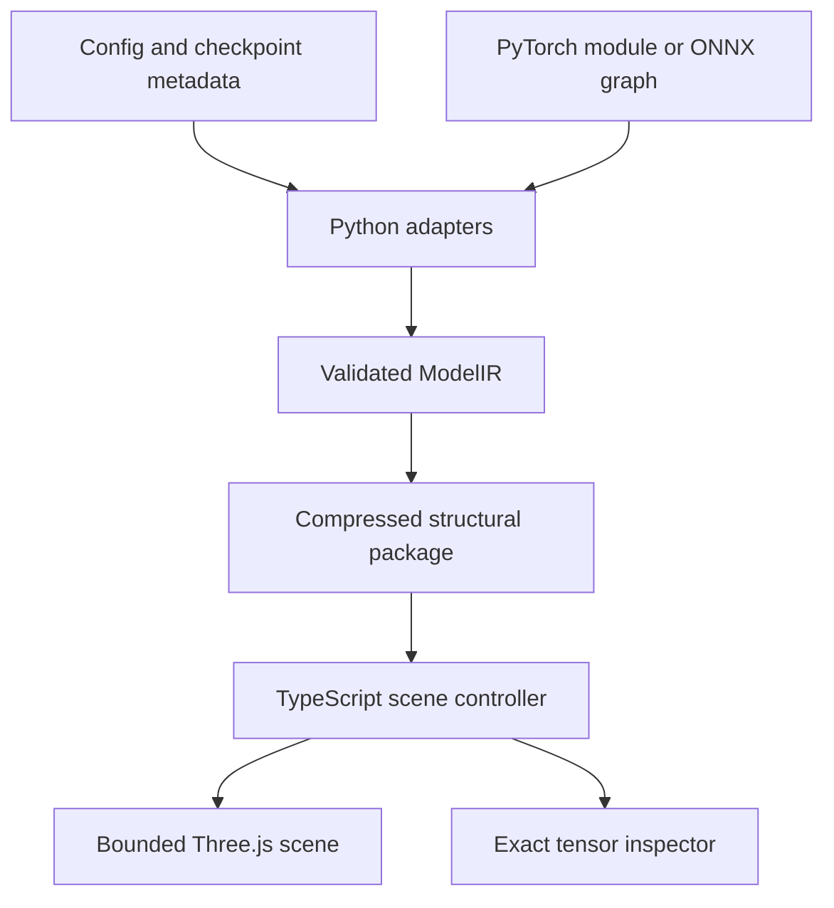

# Model Atlas

An interactive architecture explorer for neural models: a whole-model map, semantic zoom into real components, and exact tensor-coordinate inspection. Built for ordinary laptops. The supplied examples require **no inference, CUDA, Python installation, or model-weight download**.

The 2026 hero is **DeepSeek-V4-Pro**, a publicly documented, MIT-licensed open-weight model in the trillion-parameter class. GPT-2 provides a much smaller reference whose parameter count can be checked independently. A separate computed miniature explains arithmetic across connections.

This is **v0.1, ready for human review and local testing**, not a claim of production maturity or a benchmark of frontier-model quality.

## Run on a MacBook

Install Node.js **22 LTS or newer**. From the extracted repository directory:

```bash
npm install
npm run dev
```

Open the local address printed by Vite, normally `http://127.0.0.1:5173`. Use a current Safari, Chrome, or Firefox with WebGL2. The normal viewer downloads only its own bundled structural packages. Dependencies are pinned in `package-lock.json`; after the first installation, `npm ci` reproduces them.

When this repository has been published to your GitHub account, the workflow is simply `git clone <your-repository-url>`, `cd model-atlas`, `npm install`, `npm run dev`. No public GitHub repository URL is implied by this source bundle.

```bash
npm test                  # schema, accounting, arithmetic, indexing, import regressions
npm run build             # TypeScript checking + static production build
npm run preview           # inspect the production build locally
```

Python is needed only for extraction and the extractor's tests:

```bash
python3 -m unittest discover -s tests -p 'test_*.py' -v
python3 -m exporters.extract --bundled --output public/models
```

## Explore

- Drag to orbit, right-drag to pan, scroll/pinch to zoom. `F` fits the view.
- Select a component to inspect its evidence, formulas, connections, dimensions, and parameter count. Double-click or press Enter to open it. Backspace returns to its parent.
- Semantic zoom reveals actual immediate children as the selected object grows, then enters that component. Explicit navigation buttons provide the same access.
- Search addresses the full component index, including experts outside the current page. The scene never instantiates the full model.
- Open a tensor, enter a zero-based coordinate, and inspect a bounded 12×12 tile. Higher-rank tensors keep their leading coordinates fixed; the final two axes form the displayed tile.
- **Explore the arithmetic** opens a separate, computed example of projection, attention mixing, residual addition, and routing. Pause, step, or scrub the actual contributions.

Unknown values remain unavailable. A trillion-scale structural package cannot reveal trained scalar values it does not contain. Every logical parameter coordinate is addressable; inspecting its numerical value additionally requires a compatible value source. An optional local safetensors import supports raw, unquantized numeric inspection. It is not required for the bundled examples, and files are not uploaded.

## Bundled models

| Example | Purpose | Unique logical parameters | Approximate package size |
|---|---|---:|---:|
| GPT-2 | Dense reference; tied embeddings | 124,439,808 | 9 KB |
| DeepSeek-V4-Pro | 2026 hero; compressed attention, MoE, mHC | 1,598,837,347,742 including MTP | 1.55 MB |
| Computed miniature | Visible arithmetic with known operands | Not a trained model | 1 KB |

The hero uses immutable revision `b5968e9190ef611bbf34a7229255be88a0e937c1`. Its 61 core blocks and one additional MTP block are distinct. Four-stream hyper-connections are not mislabeled as ordinary residual addition. The first three routers use token-ID tables; later routers use corrected scores. CSA and HCA are represented separately.

The reconciliation covers **all 145,116 checkpoint entry names**, checks **7,030 tensor-header entries**, and reproduces **864,704,792,696 packed tensor bytes**. Logical architecture parameters, nontrainable routing-table entries, quantization scales, and the publisher's rounded active-parameter estimate remain separate. No tensor-value payloads were fetched during this review. See [the accounting record](deepseek4-provenance.md).

## Architecture



The Python layer owns model-specific interpretation, classification, parameter reconciliation, and package generation. The browser layer understands entity kinds, containment, tensors, and explicitly declared relations. **There are no model-name conditionals in rendering code.** No Python renderer, Rust, or WASM is used.

`ModelIR` stores metadata, not a mesh for every scalar. Scalar addresses are `(tensorId, indices)`. Parameter identities are independent of visible occurrences, so weight tying does not inflate counts. `dataflow`, `residual`, `parameter_share`, and `view` relations are distinct; containment never creates a computation edge.

The scene budget is 128 primary components, 192 child-summary marks, 256 relations, 40 visible labels, and 144 inspector cells. The implementation uses instanced boxes, projected-size thresholds with hysteresis, frustum tests, label overlap suppression, deterministic scope layout, on-demand rendering, a capped pixel ratio, and explicit GPU-buffer disposal. Actual laptop frame rate and memory still need device testing; these are design bounds, not measured hardware guarantees.

## Extract another model

The viewer workflow does not run these commands. Use them separately when creating a new package:

```bash
python3 -m exporters.extract --config config.json --output custom.atlas.json.gz
python3 -m exporters.extract --safetensors weights.safetensors --output catalog.atlas.json.gz
python3 -m exporters.extract --onnx model.onnx --output graph.atlas.json.gz
```

The config adapters currently accept supported GPT-2 configurations and the pinned DeepSeek-V4-Pro configuration. Unsupported configs are rejected rather than forced into a GPT template. The safetensors adapter reads only the header, and reports unknown parameter roles. The ONNX adapter needs the optional `onnx` package and does not load external tensor data or execute the graph. Inline ONNX tensor bytes are still parsed by ONNX.

For an already-created PyTorch model, including one constructed on the `meta` device:

```python
from exporters.extract import from_torch
from exporters.model_ir import write_package

ir = from_torch(model, name="My model")
write_package(ir, "my-model.atlas.json.gz")
```

Module traversal establishes containment and parameter ownership, not execution order. It does not call `forward`. Shared Parameter objects are deduplicated; distinct overlapping storage views are not coalesced. A model adapter or exported graph is required to expose functional operations.

## Review documents

- [Prior art, licensing, and design decisions](prior-art.md)
- [Visual encoding audit](visual-semantics.md)
- [ModelIR and package design](architecture.md)
- [DeepSeek metadata provenance](deepseek4-provenance.md)
- [Human review / MacBook test guide and remaining work](review-guide.md)
- [Third-party notices](../THIRD_PARTY_NOTICES.md)

The next valuable step is a trace format linking recorded operands, slices, and outputs to ModelIR operation IDs. That will let the same mathematical playback show an actual model run, without asking the laptop to execute that model. Worker-side package indexing and truly lazy metadata shards should follow profiling.

## License and acknowledgements

Independent project code is MIT licensed. Model metadata and bundled third-party materials retain their respective notices.

Grant Sanderson's 2024 3Blue1Brown transformer lessons informed the visual semantics of embeddings, projections, token flow, and attention. **No 3Blue1Brown scene code, media, or camera choreography is included or adapted.** The videos repository's CC BY-NC-SA license is distinct from the Manim engine's MIT license. This project uses Three.js, not Manim.
